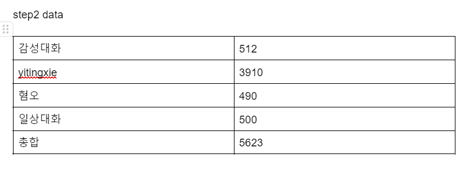

step2 dataset입니다.  

step2는 답변으로 chosen은 gpt3.5 turbo 16k의 답변으로 생성을 하였고
rejected는 kullm-v2 base model에서 2500개의 추가 일상대화 데이터로 sft 학습을 진행한 모델로 답변을 넣었습니다.

step2 raw datasets.jsonl은 yitingxie에서 수동으로 검수한 4633개의 데이터에 chosen에 gpt3.5의 답변을 넣었고 rejected에 ourmodel의 답변을 넣었습니다.
